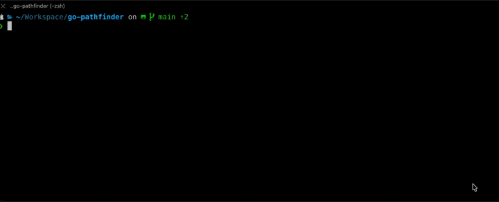

# go-pathfinder



Model on-screen TV-remote keyboards as a state graph, find the cheapest click
sequence to type a string, with three layouts (QWERTY, alphabetical, Apple TV),
three wrap policies (none, row, grid), a sticky-caps FSM, both Dijkstra and A*
solvers, and an animated `-sim` mode for watching the cursor work in the
terminal. The fundamental insight is that the cursor state is not just `(row,
col)` — it is `(layer, row, col, capsMode)`, so layer switches and caps-lock
toggles are first-class edges in the graph, not special cases bolted on after
the fact.

The math, the modelling decisions, and the typing-complexity metric Psi (H *
T_tilde / cost_per_char) are explained in detail in the companion blog post at
https://madeddu.xyz/posts/go-pathfinder/. This repo is the implementation; the
post is where the motivation and analysis live.

---

## Quick start

```sh
make build

# Type "Hello" on the default QWERTY layout with Dijkstra
./go-pathfinder -text "Hello"

# Apple TV layout, A* solver, animated at 80 ms per step
./go-pathfinder -layout appletv -algo astar -text "hello" -sim -speed 80

# Alphabetical layout, wrap=grid, print every move
./go-pathfinder -layout alphabetical -wrap grid -text "abc" -v

# QWERTY with full metrics (entropy, dispersion, Psi)
./go-pathfinder -text "qwerty" -metrics
```

---

## Flags

| Flag | Default | Purpose | Accepted values |
|------|---------|---------|-----------------|
| `-layout` | `qwerty` | Keyboard layout to use | `qwerty`, `alphabetical`, `appletv` |
| `-algo` | `dijkstra` | Pathfinding algorithm | `dijkstra`, `astar` |
| `-wrap` | _(layout default)_ | Override the wrap policy | `none`, `row`, `grid` |
| `-text` | _(empty)_ | String to type; renders layout only if empty | any string |
| `-v` | `false` | Print every move with running cursor state | boolean flag |
| `-sim` | `false` | Animate the cursor in-place (requires `-text`) | boolean flag |
| `-speed` | `250` | Per-step delay in milliseconds for `-sim` mode | integer >= 0 |
| `-metrics` | `false` | Print entropy H, dispersion T, T_tilde and Psi alongside click count | boolean flag |

---

## Build / test

```sh
make build          # compile to ./go-pathfinder
make test           # run the full test suite (go test ./... -count=1)
make fmt            # reformat source with gofmt -s -w
make lint           # run golangci-lint (falls back to go vet if not installed)
make fix            # fmt + golangci-lint --fix
make clean          # remove the compiled binary
make coverage       # run tests and print per-function coverage summary
make coverage-html  # same, then open coverage.html in the browser
```

---

## Status / scope

This is a toy project written to accompany a blog post about graph modelling
and typing-complexity metrics. It is not versioned with SemVer, not intended
for production use, and the API surface (the `Layout`, `Pathfinder`, and
`State` types) may change at any time without notice. If you are reading the
blog post and want to poke at the numbers yourself, this is the right place;
if you are looking for a production-grade input-cost library, it is not.
